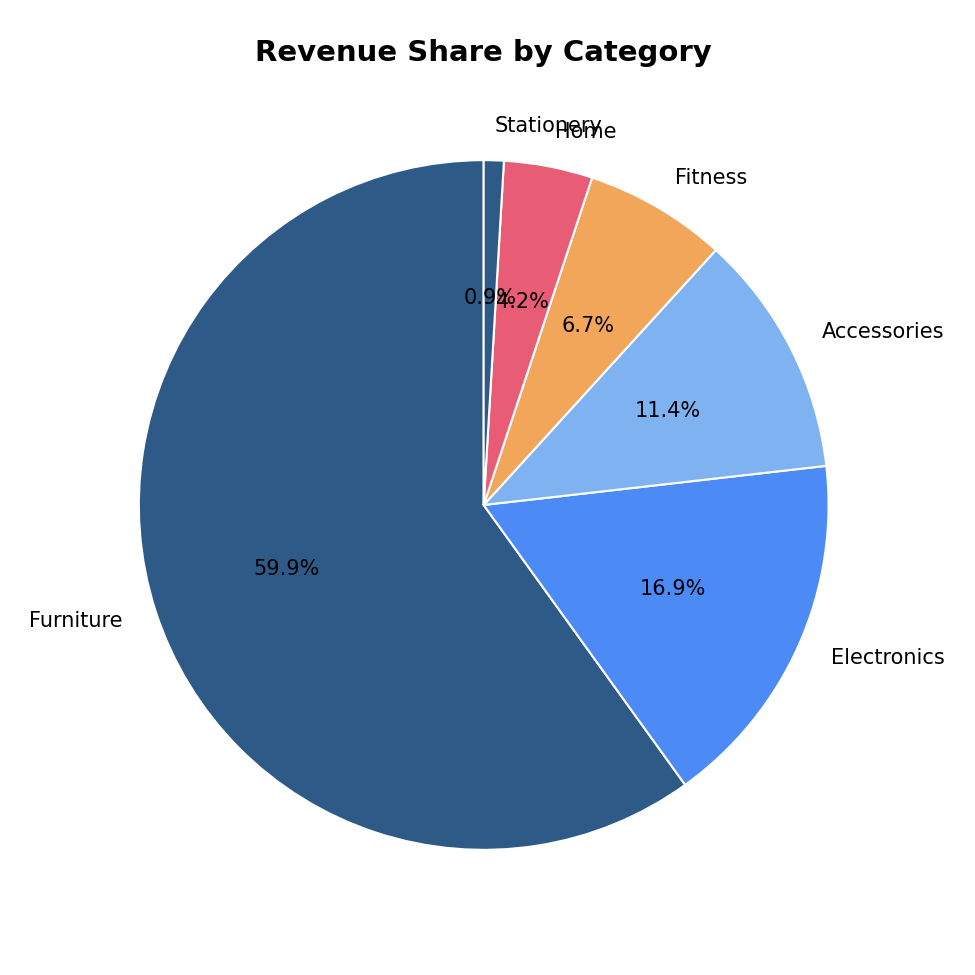

# Sales Data Cleaning & Analytics Dashboard

An end-to-end data analytics sample project: take a messy, real-world-style raw export → clean and process it → analyze it → present it as an interactive dashboard and an Excel workbook.

**[View the live dashboard](dashboard.html)** *(download and open in your browser, or host via GitHub Pages)*



## What this demonstrates

| Skill | Where it shows up |
|---|---|
| **Data Cleaning** | `02_clean_data.py` — fixes inconsistent regions, date formats, currency-symbol strings, missing values, duplicates, outliers |
| **Data Processing** | Category-level median imputation, outlier capping, computed fields (Revenue), date parsing across 4 formats |
| **Data Analytics & Visualization** | `03_analysis.py` — grouped aggregations, trend analysis, chart generation |
| **Excel / Power Pivot-style reporting** | `Sales_Summary.xlsx` — pivot tables, live formulas, embedded native Excel charts |
| **Python** | pandas, matplotlib, openpyxl — the entire pipeline is scripted and reproducible |
| **Web-based dashboard** | `dashboard.html` — interactive, responsive, built with Chart.js |

## The problem this simulates

Clients rarely hand over clean data. This project starts from a synthetic sales export (`raw_sales_data.csv`) built to include the problems you'd actually encounter:

- Region names in inconsistent casing/spelling (`gauteng`, `GAUTENG`, `Guateng`)
- Four different date formats mixed in the same column
- Prices stored as text with currency symbols (`"R 1,499.00"`)
- Missing values in quantity, price, and region
- Duplicate rows
- A few extreme outliers from data-entry mistakes (e.g. quantity = 500)

## Pipeline

```
raw_sales_data.csv
        │
        ▼
02_clean_data.py       → standardises regions, parses dates, strips currency
        │                 symbols, imputes missing values, caps outliers
        ▼
cleaned_sales_data.csv
        │
        ▼
03_analysis.py          → aggregates, generates charts, builds Excel workbook
        │
        ├──► *.png charts (monthly_trend, revenue_by_region, top_products, category_share)
        └──► Sales_Summary.xlsx  (KPI summary, pivot tables, native Excel charts)

dashboard.html          → interactive version of the same analysis (Chart.js)
```

## Key results (from the sample dataset)

- **Total Revenue:** R2,825,675
- **Total Orders:** 1,176 (after removing 39 duplicate/unrecoverable rows from 1,215 raw rows)
- **Top Region:** Eastern Cape
- **Top Product:** Standing Desk

## Repository contents

```
├── raw_sales_data.csv          # intentionally messy synthetic export
├── cleaned_sales_data.csv      # output of the cleaning script
├── 01_generate_raw_data.py     # generates the synthetic raw dataset
├── 02_clean_data.py            # cleaning & processing pipeline
├── 03_analysis.py              # analysis, charts, Excel workbook
├── monthly_trend.png           # chart export
├── revenue_by_region.png       # chart export
├── top_products.png            # chart export
├── category_share.png          # chart export
├── dashboard.html              # interactive standalone dashboard
├── Sales_Summary.xlsx          # pivot tables + KPIs + native charts
└── README.md
```

## Running it yourself

```bash
pip install pandas numpy matplotlib openpyxl
python 01_generate_raw_data.py   # regenerate raw data (optional, already included)
python 02_clean_data.py
python 03_analysis.py
```

> Note: the scripts reference `../data/` and `../charts/` paths internally (from when this was organised into subfolders). If running locally, either recreate those subfolders or adjust the paths in the scripts to match your local layout.

## Notes

- The dataset is **synthetic** — generated with a fixed random seed for reproducibility — since this is a portfolio/demo project rather than a client deliverable. The same pipeline structure applies directly to real exports from Shopify, WooCommerce, POS systems, or CRM tools.
- `dashboard.html` is fully self-contained (data is embedded directly in the file) other than one CDN reference to Chart.js — you can double-click and open it locally, no server required.
- The Excel workbook (`Sales_Summary.xlsx`) uses live formulas (e.g. `SUM`, `COUNTA`) rather than hard-coded values, and includes native Excel pivot-style tables and charts — the same pattern used for PowerPivot-driven reporting.
